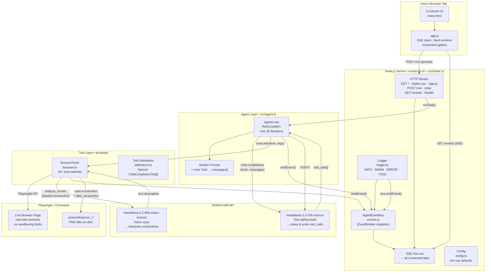
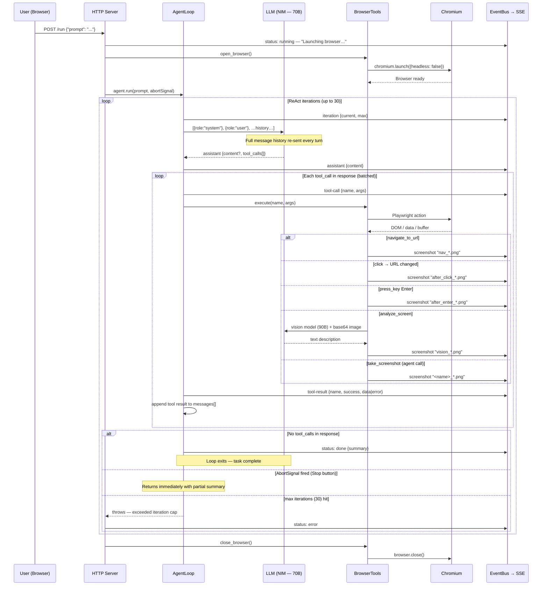

# Architecture — Browser Automation Agent

A single-user, local-first web application that lets a human type any browser task in plain English and watches an LLM-driven agent execute it inside a real Chromium window. All progress streams to the UI in real time.

---

## Stack at a glance

| Layer | Technology |
|---|---|
| Runtime | Node.js + TypeScript (`tsx` transpiler, no build step) |
| Browser | Playwright — Chromium, headed by default |
| LLM brain | NVIDIA NIM API (`meta/llama-3.3-70b-instruct`) — tool calling |
| LLM eyes | NVIDIA NIM API (`meta/llama-3.2-90b-vision-instruct`) — vision |
| API protocol | OpenAI-compatible (`/v1/chat/completions`) |
| Transport | HTTP + Server-Sent Events (Node `http` module, no Express) |
| Frontend | Vanilla HTML / CSS / JS — no framework, no bundler |

---

## Directory layout

```
src/
  index.ts          Entry point — calls startServer()
  server.ts         HTTP server, SSE fan-out, run lifecycle
  agent.ts          AgentLoop — ReAct tool-calling loop + system prompt
  events.ts         AgentEventBus — process-wide pub/sub singleton
  logger.ts         Levelled logger → console + event bus
  config.ts         Env-var config with typed defaults
  tools/
    browser.ts      BrowserTools — 30+ Playwright-backed tool methods
    definitions.ts  OpenAI-format tool schemas exposed to the LLM

public/
  index.html        3-column UI shell
  app.js            SSE client, live feed, screenshot gallery
  styles.css        Olive-green design system (CSS custom properties)

screenshots/
  <YYYY-MM-DD_HH-MM-SS>/   One subfolder per run, PNG files preserved
```

---

## Full project architecture



---

## Agentic loop — ReAct flow



---

## Tool taxonomy

BrowserTools exposes **30 tools** to the LLM, split into categories. The agent picks the right tool based on the task context.

### Lifecycle & navigation
| Tool | Purpose |
|---|---|
| `open_browser` | Launch Chromium (called automatically at run start) |
| `navigate_to_url` | Go to URL, wait for `networkidle` |
| `go_back` / `go_forward` | Browser history |
| `reload_page` | Hard reload |
| `close_browser` | Release Playwright resources |

### Perception
| Tool | Purpose |
|---|---|
| `get_page_snapshot` | **Primary sense** — DOM walker tags every visible interactive element with a stable `ref` id (`e1`, `e2`, …); returns URL, headings, elements |
| `read_page_text` | Visible text body (articles, results) |
| `get_page_info` | Quick URL + title without full snapshot |
| `take_screenshot` | Capture PNG → stream to UI + save to disk |
| `analyze_screen` | **Vision** — send screenshot to 90B vision model, ask a natural-language question |

### Ref-based actions (preferred)
| Tool | Purpose |
|---|---|
| `click` | Click by snapshot ref |
| `double_click_element` | Double-click by ref |
| `hover` | Hover by ref (reveals menus/tooltips) |
| `fill` | Set input/textarea value — fires React `onChange` |
| `clear_field` | Empty a field by ref |
| `select_option` | Choose `<select>` option by ref |
| `set_checkbox` | Check/uncheck checkbox/radio by ref |
| `scroll_to` | Scroll element into view by ref |
| `upload_file` | Set file input paths by ref |
| `drag_and_drop` | Drag one ref onto another |

### Selector-based fallbacks
| Tool | Purpose |
|---|---|
| `find_element` | CSS selector → centre pixel coordinates |
| `fill_element` | Fill by CSS selector (when no ref is available) |

### Coordinate & keyboard
| Tool | Purpose |
|---|---|
| `click_on_screen` | Click at absolute pixel (x, y) |
| `drag_on_screen` | Mousedown → move 20 steps → mouseup — for canvas drawing |
| `double_click` | Double-click at pixel |
| `send_keys` | Type text into focused element |
| `press_key` | Press key/chord (`Enter`, `Control+A`, `ArrowDown`, …) |
| `scroll` | Wheel scroll by pixel deltas |

### Sync / waiting
| Tool | Purpose |
|---|---|
| `wait_for` | Wait for visible text, CSS selector to attach, or fixed ms |

### Tabs
| Tool | Purpose |
|---|---|
| `new_tab` | Open tab, optionally navigate |
| `list_tabs` | All open tabs (index, url, title, active flag) |
| `switch_tab` | Activate tab by index |
| `close_tab` | Close tab by index |

### Advanced
| Tool | Purpose |
|---|---|
| `evaluate_js` | Run arbitrary JS in page, return JSON result |
| `handle_dialog` | Pre-configure accept/dismiss for next native dialog |

---

## Event bus & SSE pipeline

All components publish to a single `AgentEventBus` (Node `EventEmitter`). The server subscribes once at startup and fans every event out to all connected SSE clients.

```
AgentLoop ──┐
BrowserTools─┼──► AgentEventBus ──► SSE fan-out ──► app.js switch(ev.type)
Logger ──────┘
```

**Event types rendered by the frontend:**

| Type | Fields | Rendered as |
|---|---|---|
| `status` | `state`, `message` | Status text (`Idle` / `Done` / `Error`) |
| `iteration` | `current`, `max` | Step counter in header |
| `log` | `level`, `message`, `data` | Feed row (INFO / WARN / ERROR) |
| `tool-call` | `name`, `args` | Feed row with emoji icon + args preview |
| `tool-result` | `name`, `success`, `result` | Feed row with ✓ / ✗ |
| `assistant` | `content` | Feed row 🤖 Agent |
| `screenshot` | `name`, `dataUrl` | Screenshot gallery (base64 inline) |

---

## Auto-screenshot triggers

Screenshots fire automatically without the agent needing to call `take_screenshot`:

| Trigger | Filename prefix | Condition |
|---|---|---|
| `navigate_to_url` success | `nav_` | Every successful navigation |
| `navigate_to_url` timeout | `nav_partial_` | networkidle timed out (page still usable) |
| `click` causing URL change | `after_click_` | `page.url()` differs before vs after click (400 ms wait) |
| `press_key("Enter")` | `after_enter_` | After 800 ms settle wait |
| `analyze_screen` | `vision_` | Always — screenshot sent to vision model is also shown in UI |
| `take_screenshot` (agent call) | `<filename>_` | Agent-initiated explicit milestone |

All files land in `screenshots/<YYYY-MM-DD_HH-MM-SS>/` — one folder per run, never deleted.

---

## Configuration

All config lives in `.env`. Typed defaults in `src/config.ts`.

| Variable | Default | Purpose |
|---|---|---|
| `NIM_API_KEY` | *(required)* | NVIDIA NIM API key |
| `NIM_BASE_URL` | `https://integrate.api.nvidia.com/v1` | OpenAI-compatible base URL |
| `MODEL` | `meta/llama-3.3-70b-instruct` | Tool-calling LLM |
| `VISION_MODEL` | `meta/llama-3.2-90b-vision-instruct` | Vision LLM |
| `VISION_ENABLED` | `true` | Set `false` to hide `analyze_screen` from the agent |
| `TEMPERATURE` | `0.2` | Low = deterministic tool calls |
| `HEADLESS` | `false` | Set `true` for server / CI environments |
| `MAX_ITERATIONS` | `30` | Safety cap on ReAct loop depth |
| `PORT` | `3000` | HTTP server port |

---

## Key design decisions

**ReAct completion keyed on tool_calls absence, not finish_reason** — NIM/Llama over the OpenAI-compatible endpoint sometimes reports `finish_reason: "stop"` even when `tool_calls` are present. The loop exits only when `tool_calls` is absent or empty, never on `finish_reason` alone.

**Full message history re-sent every turn** — the model has no persistent memory between API calls; the entire `messages[]` array grows with each iteration and is sent in full. Complete context of every observation and action is always available.

**Ref-based DOM snapshot preferred over coordinates** — `get_page_snapshot` injects a DOM walker that tags every visible interactive element with `data-agent-ref`. Ref-based actions survive small layout changes and are more reliable than pixel coordinates. Coordinates are a fallback for canvas / icon-only UIs.

**Viewport: null** — Playwright launches Chromium with no forced viewport, so the window adapts to the OS default and the user can resize freely.

**One run at a time** — a `busy` boolean guards the `/run` endpoint. Concurrent requests get HTTP 409. The browser is a single shared resource.

**Vision as opt-out** — `analyze_screen` is included in the tool list only when `VISION_ENABLED=true`. Without it the agent relies on DOM snapshot + text only, saving API quota for simple tasks.

**No build step** — `tsx` transpiles TypeScript on the fly. Changes to `src/` require a server restart but no compile step, keeping the dev loop fast.
